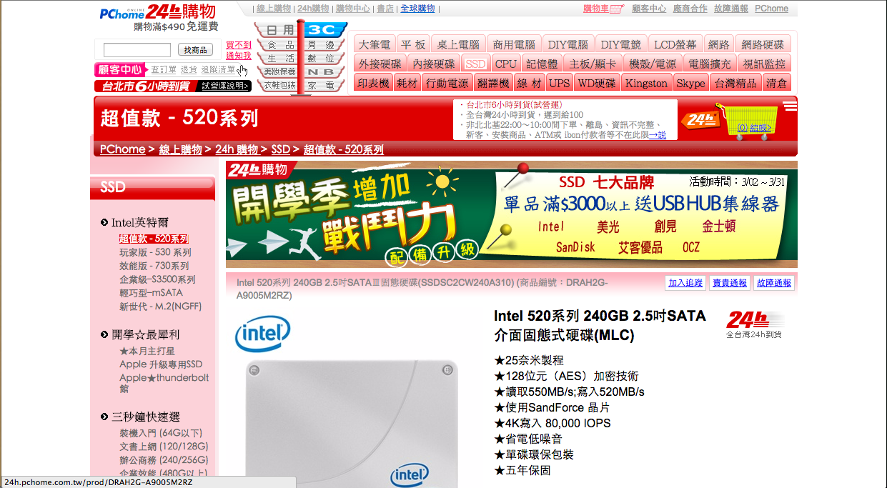
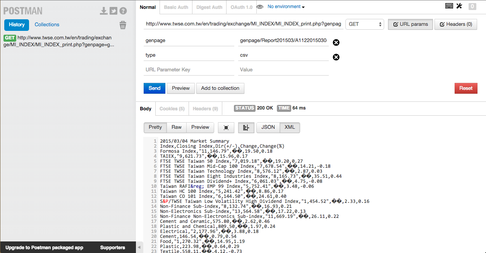
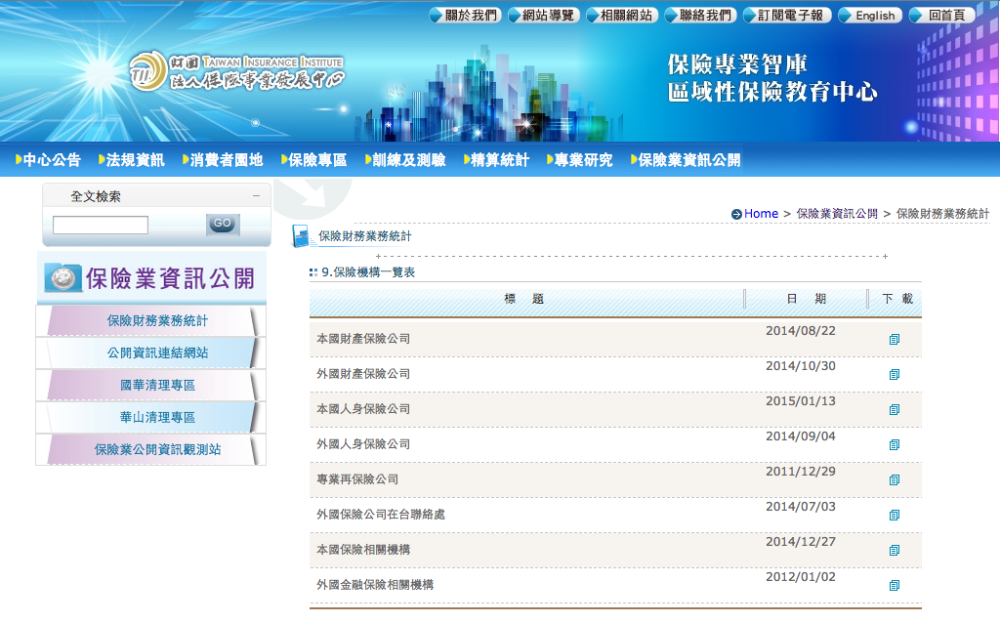

<h1>
  <font color=#005CE6>R Basic with Web Crawler</font>
</h1>
<h3>
  <font color="green">Week 1</font>
</h3>
<h3>
  <font color=#CCCCA3>Agilearning.IO</font>
</h3>

<h3>
  <font color=#CCCCA3>木刻思股份有限公司</font>
</h3>

--- &vertical

# 本週學習目標

***

- 基礎網路知識
- 安裝與使用套件
- 爬蟲 GUI 工具的使用
- 讀取本機端或遠端資料
- R 基本資料結構與操作

--- &vertical

# Packages

<div align='left'>
<p>R 是個開源免費的軟體。</p>

<p>有非常多人 (駭客們) 幫它撰寫各式各樣的套件。</p>

<p>我們要去哪裡看說 R 有什麼套件呢?</p>

<p class='fragment'>主要有兩大管道:</p>
<ul>
  <li class='fragment'><a href='http://cran.r-project.org/'>CRAN</a></li>
  <li class='fragment'><a href='https://github.com/'>Github</a></li>
<ul>
<br>
<p class='fragment'>
<font size=8 color="yellow">到底我們該怎麼使用這些套件呢 =  =?</font>
</p>
</div>

***

## Packages

為了使用這些套件，我們必須先安裝它們。

- 在 R 裡安裝套件也非常簡單
- 以接下來爬蟲例子中會需要的 XML 套件為例。

```{r, cache=TRUE}
install.packages("XML")
```

***

## Packages

- 很好! 你已經成功安裝 XML 套件了。
- 為了把包含在 XML 這個套件中的相關函數"引入"供你差遣，我們需要 library() 這個函數。


```{r, cache=TRUE}
library("XML")
```

<div align='left'>
<p class='fragment'>That's it! You are ready for building simple web-crawler now.</p>
<p class='fragment'>眼見為憑，我們用一個小例子示範一下。</p>
</div>

--- &vertical

<h2>Example: TWSE </br>(臺灣證券交易所)</h2>

<br>

<center>
<font size=8>
  <p class='fragment'>This way to <a href='http://www.twse.com.tw/en/'>TWSE</a></p>
</font>
</center>

***

## TWSE 英文首頁


***


***


***

## The Code

```{r, cache=TRUE}
MOPS_URL.TWSE_ALL <-
  "http://www.twse.com.tw/en/listed/listed_company/apply_listing.php?page=1"

web_page <- htmlParse(MOPS_URL.TWSE_ALL,encoding="big5")
data <- readHTMLTable(web_page, which=6, stringsAsFactors=F, header = T)
names(data) <- 
  c("Application Date", "Code", "Company", "Chairman","Amount of Capital",
    "Underwriter")
data <- data[-1,]
head(data, n=3)
```

<p class="fragment">
<font color='red' size="8">Magic!</font>
</p>

***

# Your Turn!

<ul>
  <li class="fragment">平常上班不能上網亂看東西，今天可以!</li>
  <li class="fragment">找幾個有興趣的網站，並且把有興趣的資料在網站哪裡標註起來。<br>
    (print screen)</li>
  <li class="fragment">你想抓的網站有可能是靜態網頁，也可能是動態的。(What!?)</li>
  <li class="fragment">別緊張，四週課程過去後，你會了解之間的差別，也會知道如何處理它。</li>
  <li class="fragment">記得把網址都記下來噢!等等會有用。</li>
</ul>

--- &vertical

<h1>爬蟲心法
  <h2>
  <font color="yellow">模仿你的瀏覽器</font>
  </h2>  
</h1>

***

## 爬蟲心法：模仿你的瀏覽器

<ul>
 <li>基本上來說，寫爬蟲就是寫程式去模仿瀏覽器的行為。</li>
 <li>把你想要的資料從瀏覽器讀到的資料中取出來，就是一隻基本的爬蟲。</li>
 <li>那到底瀏覽器讀到了什麼資料啊??</li>
 <li>Chrome 與 Firfox 是你的好朋友。</li>
 <li class='fragment'>IE 咧?</li>
</ul>

<p class="fragment">
<font size=8 color='red'>不要問....很可怕 =  =+</font>
</p>

--- &vertical

<h1>爬蟲小幫手
  <h2><font color="yellow">GUI 小道具</font></h2>
</h1>

***

## 爬蟲小幫手: GUI 小道具

- 開發人員工具 in Chrome & Firfox
  * Mac: Cmd + Shift + I
  * Linux: Ctrl + Shift + I

***


***

<ul>
  <li>
    Postman (Chrome Plug-in)
      <ul>
        <li class='fragment'>簡單的圖形介面讓你可以對伺服器發 request。</li>
        <li class='fragment'>不懂啥是 request? 沒關係，等等會解釋。</li>
        <li class='fragment'>先偷看一下它長什麼樣子就好。</li>
      </ul>
  </li>
</ul>

***


--- &vertical

# HTTP

***

## What is HTTP?

<div align='left'>
<ul>
<li class='fragment'>HTTP 是 "Hypertext Transfer Protocol" 的縮寫。</li>
</ul>
</div>

<div class='fragment'>
<font color='yellow'>
  有說等於沒說....=   =
</font>
</div>

<ul>
<li class="fragment">HTTP 是一種通訊協定，規定好客戶端 (client) 要如何跟伺服器端 (server) 做溝通。</li>
<li class='fragment'>簡而言之，HTTP 之於網路，就如同文法之於英文。</li>
<li class='fragment'>粗略來分，可以分為 POST、GET、PUT、DELETE ....等。</li>
</ul>

<div class="fragment" align='left'>
  其中寫爬蟲最常用的，就是 GET 與 POST 這兩種方法。
<br>

<ul>
  <li class='fragment'>更詳盡的資料可以參考<a href='http://en.wikipedia.org/wiki/Hypertext_Transfer_Protocol'> Wiki </a>上的說明。</li>
</ul>
</div>

***

簡而言之，一般網路的運作方式大致上入下圖所示：


--- &vertical

# GET METHOD

***

## 忙碌的瀏覽器

<div class='fragment'>
打從我們打開一個網頁開始，瀏覽器就沒有停止工作過。
</div>
<div class='fragment'>我們先來看看瀏覽器做了些什麼事。</div>
<div class='fragment'>
<font color='blue'>
  Chrome 開發人員工具
</font>
</div>

***

## Network


<div class='fragment'>
<font color='red' size='8'>
  滿坑滿谷的 GET 啊!
</font>
</div>

***

<ul>
  <li>瀏覽器在我們打開這個網頁的時候，會幫我們下載了這個網頁所有需要的圖片、聲音與資料。</li>
  <li class='fragment'>等檔案下載好後，再排版成我們肉眼看到的網頁。</li>
  <li class='fragment'>
    <font color='yellow'>
      瀏覽器 OS: 我把資料都藏在這裡了，想要的人就去拿吧!
    </font>
  </li>
  <li class='fragment'>在我們登上偉大的航道前，再多觀察一些其他的東西吧。</li>
</ul>

***

## GET - More Than You Can Imagine

<ul>
  <li class='fragment'>URL (網址) 也可能包含了一些額外資訊，讓瀏覽器可以從 server 拿到不一樣的資料。</li>
  <li class='fragment'>這些資訊可能包含 id 、當前頁數、日期等等資訊。</li>
  <li class='fragment'>瀏覽一下 TWSE 的網站並觀察它網址的變化吧!</li>
</ul>

***

常見的 URL 形態：

<div align='left'>
  <ol>
    <li class='fragment'>
      <font color='wheat'>
      domain_name/path/to/specific/page
      </font>
    </li>
    <li class='fragment'>

      ../../..<font color='#E6E6B8'>?</font><font color='#FF9933'>field1</font><font color='#8DE28D'>=</font><font color='#9DDEFF'>value1</font><font color='#E6E6B8'>&</font><font color='#FF9933'>field2</font><font color='#8DE28D'>=</font><font color='#9DDEFF'>value2</font><font color='#E6E6B8'>&</font><font color='#FF9933'>field3</font><font color='#8DE28D'>=</font><font color='#9DDEFF'>value3</font>
    </li>
  </ol>
  <br>
  <br>
  <div class='fragment'>
  <font>
    上述兩種 URL 再 <a href="http://www.twse.com.tw/en/">TWSE</a> 的網站上都找得到。
  </font>
  </div>
  <br>
  <div class='fragment'>
  <font>
    舉例來說，我們現在瀏覽的是英文界面，如果想瀏覽中文的呢? 它們的 URL 有什麼變化？
  </font>
  </div>
</div>

<br>
<br>
<p class='fragment'>
<font color='red'>
  Try it!
</font>
</p>

***

## What Can We "Get"?

***

常見的資料形態:

<ul>
  <li class="fragment">HTML/XML text</li>
  <li class='fragment'>Files. (csv, tsv...etc)</li>
  <li class='fragment'>JSON</li>
</ul>

<div class='fragment'>來看看它們長啥樣子吧!</div>

***

<h2>瀏覽器之<font color="yellow">HTML</font></h2>

***

## 瀏覽器之HTML

- HTML 是 Hyper Text Markup Language 的縮寫。
- 以一個 tag 為基本單位，一般稱一個 tag 為一個 element 。
- 所謂的一個 tag ，指的是一組 <>...</>。 (有些 tag 只有一個 <>)
- 有樹狀結構。(DOM tree)
- 瀏覽器會根據下載到的 html 檔案去排版，成為人肉眼看到的網頁。

***

## Example: DOM tree


<a href="http://www.openbookproject.net/tutorials/getdown/css/lesson4.html">圖片來源</a>

***

## DOM tree: The Code

        <html>
          <head>
            <meta></meta>
            <title></title>
            <style type="text/css"></style>
          </head>
          <body>
            <h1></h1>
            <section></section>
            <footer></footer>
          </body>
        </html>

***

### Excersice:

- 用 Chrome 或 Firefox 的開發人員工具，把剛剛你找到的那些網頁的 html 檔案打開看看。
- 找看看你有興趣的資料在這些 html 檔案中的哪裡?

***

## Files

***

<a href="http://www.twse.com.tw/en/trading/exchange/MI_INDEX/genpage/Report201503/A11220150304MS.php?select2=MS&chk_date=2015/03/04#">
  Market Info > Historical Trading Info/Data >Daily Quotes
</a>


***

## JSON

***

以 PChome 網路商城為例




***

破解後台


[後台抵家](http://ecapi.pchome.com.tw/ecshop/prodapi/v2/prod/DRAH2G-A9005M2RZ-000&fields=Seq,Id,Name,Nick,Store,PreOrdDate,SpeOrdDate,Price,Discount,Pic,Weight,ISBN,Qty,Bonus,isBig,isSpec,isCombine,isDiy,isRecyclable,isCarrier,isMedical,isBigCart,isSnapUp,isDescAndIntroSync&_callback=_)

***

以這個後台的 URL 來說，你可以猜到它代表的意義嗎?

<div class='fragment'>想想看</div>
<ul>
  <li class='fragment'>什麼是 fields ?</li>
  <li class='fragment'>'fields=' 後面的東西又是什麼?</li>
  <li class='fragment'>如果我不想要商家的名字，要怎麼做呢?</li>
</ul>
<br>
<br>
<p class='fragment'>
  <font color='red'>
    在 Ajax 技術一章會有進一步的介紹。
  </font>
</p>

--- &vertical

# GET Request by PostMan

***

用 PostMan 把這個 csv 下載下來!


***



<div class='fragment'>
  Is there anything wrong with this csv file?
</div>
<div class='fragment'>
  What is 'csv file' anyway?
</div>
<div class='fragment'>
  <font color='red'>
    Google the information you need and think about it!
  </font>
</div>

--- &vertical

# Parsor for Files

***

What does a parsor do in a spider?

<ul>
  <li class='fragment'>Collecting data from connector.</li>
  <li class='fragment'>
    The more important is <font color='yellow'>extracting neccessary information</font> out of raw data.
  </li>
  <li class='fragment'>We will see more examples in later chater <em>R Basic</em>.</li>
</ul>

--- &vertical

# The Basic Components of a WebSpider

***


***

## R Code - Review

```{r, results='hide'}
rm(list=ls())
MOPS_URL.TWSE_ALL <-
  "http://www.twse.com.tw/en/listed/listed_company/apply_listing.php?page=1"

web_page <- htmlParse(MOPS_URL.TWSE_ALL,encoding="big5")
data <- readHTMLTable(web_page, which=6, stringsAsFactors=F, header = T)
names(data) <- 
  c("Application Date", "Code", "Company", "Chairman","Amount of Capital",
    "Underwriter")
data <- data[-1,]
head(data, n=3)
```

<div class='fragment'>
  根據目前為止學到的網路與爬蟲知識，你可以說說看上面每一行的指令在做些什麼嗎?
</div>
<br>
<div class='fragment'>
  <font color='yellow'>
    Try and find it out!
  </font>
</div>

--- &vertical

# R Basic

***

## Basic Data Types

```{r, results='hold', cache=T}
(s <- "I love R!") # This is string
(b <- T) # Boolean
(f <- pi) # Floating number (real number).
(i <- 3) # Integer
```

***

## Basic Data Structure - Vector

```{r, results='hold', cache=T}
v1 <- c(1, 2, 3) # c() is the concatenate function in R.
v2 <- c(2, 3)
(r1 <- v1 + v2)
(r2 <- v1 * v2)
```

***

c() can be used to combine vectors into one vector.

```{r, results='hold', cache=T}
c(v1, v2)
```

***

All elements in a vector must be of the same type

```{r, results='hold', cache=T}
v <- c(1, 2, "3")
v
```

***

## Basic Data Structure - List

List, different from vector, can be used for storing data of different types.

```{r, results='hold', cache=T}
c3h3 <- list(name="c3h3", age=30, height=172, weight=65.3)
c3h3
```

***

c() can be also used for combining lists.

```{r, results='hold', cache=T}
c3h3 <- c(c3h3, list(zip_code='100'))
c3h3
```

***

## Your Best Friend - Dataframe

```{r, results='hold', cache=F}
require(gdata)
domestic_ins_company <- read.xls("http://www.tii.org.tw/images_P2/%E6%9C%AC%E5%9C%8B%E7%94%A2%E9%9A%AA%E5%85%AC%E5%8F%B8_20140822.xls")
(names(domestic_ins_company))
head(domestic_ins_company, n=2)
```

<div class='fragment'>
  Frankly speaking, dataframe is just like a table with bunch of useful features.
</div>

***

<div align='left'>
  <div class='fragment'>
    <code>domestic_ins_company</code> 是直接從金管會業務統計資料中的保險機構一覽表中拿到的本國保險機構資料。
  </div>
  <br>
  <div class='fragment'>聰明的你猜得出來我是從哪裡找到 xls 的網址的嗎?</div>
  <br>
  <div class='fragment'>
    在此例中，<code class='r'>read.xls</code> 就是扮演著 parsor 的角色，讓你可以把資料讀進 R 中做進一步的處理。
  </div>
  <br>
  <div class='fragment'>
    想想看，如果要爬金管會的資料，你的作業流程會是如何? <br>
    程式大概又應該怎麼寫呢?
  </div>
</div>

***

## 情境

我有 8 個網址要爬，難不成我要複製貼上 8 次 <code class='r'>read.xls</code> !?


<div class='fragment'>
  <font color='yellow'>For loop is all you need!</font>
</div>
<br>
<div class='fragment'>我們一樣用金管會的網站當例子</div>

***

This way to the [website](http://www.tii.org.tw/fcontent/IInformation_Disclosure/information03_01.asp?P2b_sn=15)



***

```{r, cache=T, results='hold'}
urls <- list("http://www.tii.org.tw/images_P2/%E6%9C%AC%E5%9C%8B%E7%94%A2%E9%9A%AA%E5%85%AC%E5%8F%B8_20140822.xls",
            "http://www.tii.org.tw/images_P2/%E5%A4%96%E5%9C%8B%E7%94%A2%E9%9A%AA%E5%85%AC%E5%8F%B8_20141030.xls",
            "http://www.tii.org.tw/images_P2/%E6%9C%AC%E5%9C%8B%E5%A3%BD%E9%9A%AA%E5%85%AC%E5%8F%B8_20150113.xls",
            "http://www.tii.org.tw/images_P2/%E5%A4%96%E5%9C%8B%E5%A3%BD%E9%9A%AA%E5%85%AC%E5%8F%B8_20140904.xls",
            "http://www.tii.org.tw/images_P2/%E5%B0%88%E6%A5%AD%E5%86%8D%E4%BF%9D%E9%9A%AA%E5%85%AC%E5%8F%B81001228.xls",
            "http://www.tii.org.tw/images_P2/%E5%A4%96%E5%9C%8B%E4%BF%9D%E9%9A%AA%E5%85%AC%E5%8F%B8%E5%9C%A8%E5%8F%B0%E8%81%AF%E7%B5%A1%E8%99%9520140703.xls",
            "http://www.tii.org.tw/images_P2/%E6%9C%AC%E5%9C%8B%E4%BF%9D%E9%9A%AA%E7%9B%B8%E9%97%9C%E6%A9%9F%E6%A7%8B_20141227.xls",
            "http://www.tii.org.tw/images_P2/%E5%A4%96%E5%9C%8B%E9%87%91%E8%9E%8D%E4%BF%9D%E9%9A%AA%E7%9B%B8%E9%97%9C%E6%A9%9F%E6%A7%8B1010102.xls")
results <- list()
for (url in urls){
  print(paste("Processing ", url))
  data <- read.xls(url, header=T, stringsAsFactors=F)
  results <- c(results, list(data))
}
```

***

```{r, cache=F, results='hold'}
head(results[[1]], n = 3)
```

<div class='fragment'>
  <font color='yellow'>
    咦!? <code class='r'>results[[1]]</code> 是什麼?
  </font>
</div>  

***

## Slice

<ul>
  <li class='fragment'>
    在上面的例子裡，我們可以在 R 裡面可以用很簡單直觀的方式，也就是 <code>[index1[, index2, ...]]</code> 之類的語法來存取特定區塊的資料。稱之為 slicing。
  </li>
  <li class='fragment'>vector、list 與 data.frame 有著不同的 slicing 語法。</li>
</ul>

***

## 範例

```{r, results='hold'}
v <- c(1:20) # v 是個 vector
l <- list(pi, 306, "Taishin") # l 是個 list
df <- data(iris) # df 是個 data.frame

print(c("v[3]", v[3])) # 抽取 v 的第三個 element
print(c(class(l[3]), class(l[[3]]))) # [] 與 [[]] 的差別
print(iris[c(2, 5), c(1, 3, 5)]) # data.frame 的 slicing 語法
```

***

## 補充說明 - Slicing for Dataframe

Dataframe 長得像這樣子 (以 iris 為例)


***

<code class='r'>irirs[c(2, 5), c(1, 3, 5)]</code> 
<br>
或者是 
<br>
<code class='r'>iris[c(2, 5), c("Sepal.Length", "Petal.Length", "Species")]</code>


***

<code class='r'>head(df, n=6)</code> 顧名思義，會顯示 df 前 n 筆資料

```{r, cache=T, results='hold'}
head(iris) # 預設 n 是 6 筆
```

***

<div class='fragment'>做人做事就要有頭 (head) 有尾 (tail) !</div>
<br>
<div class='fragment'>寫 code 學人生哲理。(茶)</div>
<br>
<div class='fragment'>
  <code class='r'>tail(df, n=6)</code> 跟 <code class='r'>head()</code> 成對，會顯示 df 最後 n 筆資料
</div>

***

```{r, cache=T, results='hold'}
tail(iris) # 預設一樣是 6
```

***

除了 list 可以取名字、data.frame 有欄位名，vector 也是可以取名字並且用 <code class="r">[]</code> 取存取它!

```{r, cache=T, results='hold'}
weights <- c(hsiang=70, c3h3=62, dboy=82)
weights["c3h3"]
``` 

***

<h2>
  <code class='r'>[]</code> 與 <code class='r'>[[]]</code> 是不一樣的
</h2>


```{r, results='hold', cache=T}
class(c3h3["weight"]) # 是個 list
class(c3h3[["weight"]]) # 是個數字
```

***

回頭看看之前抓到的資料

```{r, cache=T, results='hold'}
(head(results[[1]], n=2))
```


<div class='fragment'>
  <font color='yellow'>
    大家覺得抓下來的資料有什麼問題?
  </font>
</div>
<br>
<div class='fragment'>
  用剛剛學到的 slicing 語法看看這些 data.frame 吧!
</div>

***

## ? 與 ??

<div>?/?? 是 R 裡的 helper function</div>
<br>
<div class='fragment'>
  可使用 <code class='r'>?command</code> 去查詢相關文件與指令說明。
</div>

***

## 範例

```{r, cache=T, results='hold'}
?c # 查詢 c 的說明文件
??c # 搜尋所有有關 c 的說明文件
```


--- &vertical

# Homework

***

<ul>
  <li>
    <a href="http://data.gov.tw/">政府資料開放平台</a>
    <ul>
      <li>下載不動產買賣實價登錄批次資料 (csv)</li>
      <li>請問瀏覽器這時是發 GET 還是 POST request? 哪裡可以看到相關資訊呢?</li>
      <li>下載下來的 csv 檔如何讀進 R ?</li>
      <li class='fragment'>Hint: <code class='r'>read.csv</code></li>
    </ul>
  </li>
</ul>

***

<ul>
  <li><font color='#00FFFF'>Post Method</font></li>
  <ul>
    <li class='fragment'>運用 Chrome (Firefox) 開發者工具找出可以發 post request 的網站</li>
    <li class='fragment'>Hint: 尋找 form tag。 <br>
      <span><</span><font color='#FF0040'>form</font> <font color="#31B404">action</font>=<font color="#F7D358">'...'</font><span>></span>.....<span><</span>/<font color='#FF0040'>form</font><span>></span></li>
  </ul> 
</ul>

--- &vertical

# Q & A


