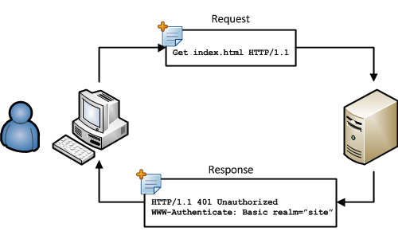
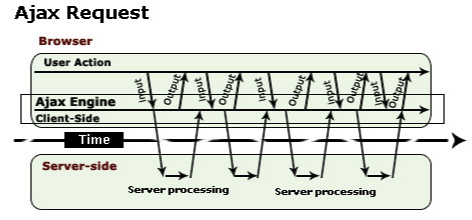
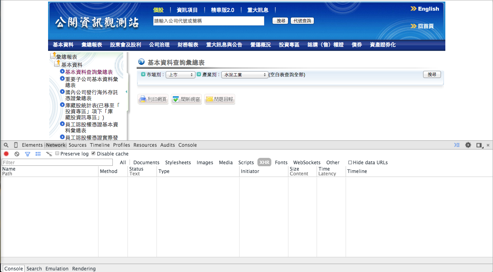
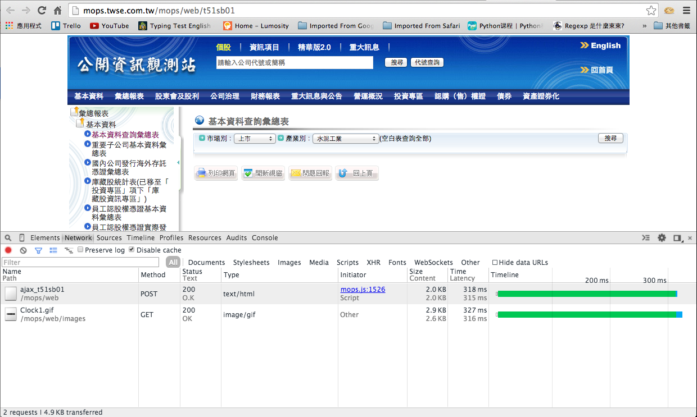

<h1>
  <font color=#005CE6>R Basic with Web Crawler</font>
</h1>
<h3>
  <font color="green">Week 2</font>
</h3>
<h3>
  <font color="black">Chia-Chi Chang</font>
</h3>

--- &vertical

# 本週學習目標

***

- 靜態網頁 v.s 動態網頁: Ajax
- Post Method
- Selector (XPath)
- WebDriver RSelenium 的使用
- R Basic
	- 自定義 Function
	- 控制流程: if、while
	- Data I/O

--- &vertical

# Ajax

***

## Ajax 簡介

<div align='left'>
	<ul>
		<li class='fragment'>Ajax 是 Asyncronized Javascript and XML 的縮寫。</li>
		<li class='fragment'>是一種非同步的網路技術 (動態網站)。</li>
	</ul>
</div>
<br>
<div class='fragment'>
	<font color='red'>阿鬼....你還是說中文吧? =   =</font>
</div>
<br>
<div align='left'>
	<ul>
		<li class='fragment'>另一方面來說，傳統的 HTTP 中的 Request - Response 是我們常說的靜態網站。</li>
	</ul>
</div>

***

## 複習一下

還記得這張圖嗎？



<div class='fragment'>Request - Response 的互動模式可能會有什麼問題？</div>

***

<div align='left'>
	傳統靜態網頁:
	<br>
	<ul>
		<li class='fragment'>client 端可能要等很久才會得到 response</li>
		<li class='fragment'>client 端閒置時間長，負擔小; sever 端處理大量網頁，負擔大。</li>
	</ul>
	<br>
	<br>
	<div class='fragment'>有沒有什麼方法可以:
		<ul>
			<li class='fragment'>縮短等待時間</li>
			<li class='fragment'>減少 client 閒置時間，多加利用 client 端的資源</li>
		</ul>
	</div>
	<br>
	<div class="fragment">Ajax 就是為了因應這類需求所誕生的。</div>
</div>

***

## Ajax in a Nutshell


<br>
[圖片來源](http://www.javajazzup.com/issue10/page11.shtml)

***

以 Week1 投影片中的 PChome 網站為例：

<a href="http://24h.pchome.com.tw/prod/DRAH2G-A9005M2RZ">
	
</a>


***

## Summary of Ajax

<ul>
	<li class='fragment'>Ajax 技術可以非同步的方式改變頁面。</li>
	<li class='fragment'>使用 callback 可以針對不同的 response 做出反應。</li>
	<li class='fragment'>現行大部份的網站都有使用 Ajax 技術來提升使用者經驗。</li>
	<li class='fragment'>可用停用 javascript 來檢定想爬的網站是否有使用 Ajax 技術。</li>
</ul>
<br>
<div class='fragment'>
	<font color='green'>太好了....我除了要學 R 還要學 javascript 才能寫爬蟲!?</font>	
</div>
<br>
<div class='fragment'>
	<font size=14 color='red'>崩潰!!!</font>
</div>

***

<div align='left'>
	別緊張，因為我們可以:
	<br>
	<br>
	<ul>
		<li class='fragment'>利用 WebDriver 可以讓你省去破解 javascript code 的時間。</li>
		<li class='fragment'>今天後續的課程會教你如何用 RSelenium 這個套件去操作 Selenium 以達到自動化爬蟲的目的。</li>
	</ul>
</div>


--- &vertical

# Post Method 
## in Practice

***

以公開資訊觀測站為例：

- 進入[公開資訊觀測站](http://mops.twse.com.tw/mops/web/t51sb01)
- 打開開發人員工具
- 你應該會看到:



***

- 點開 Network 分頁
- 開始瀏覽網站
- 觀察 Network 分頁所顯示的資訊

<div class='fragment'>說說你的發現吧!</div>

***

網頁自己動起來了!



<div class='fragment'>
	<font color='red'>
		咦? POST 耶!
	</font>
</div>

***

## Post in Detail

<div align='left'>
	根據 <a href="http://www.w3schools.com/tags/ref_httpmethods.asp">w3school</a> 的說明，POST 與 GET 最大的不同是:
	<ul>
		<li class='fragment'>GET 用於從 server 讀取資料; POST 用於提交資料給 server 處理。</li>
		<li class='fragment'>GET 提交的資料會顯示于網址中; POST 提交的資料是存在于 HTTP 訊息主體中。</li>
		<li class='fragment'>以資料安全性來說，POST 比較安全。</li>	
	</ul>
</div>

***

<div align='left'>
	如果經過剛剛的說明，你還是不太懂?
	<br>
	<br>
	<div class='fragment'>沒關係，以寫爬蟲來說影響不大</div>
	<br>
	<div class='fragment'>你只需要知道有時候你必須要使用 POST request 才能拿到資料</div>
	<br>
	<div class='fragment'>接下來就是學習如何用 R 發 POST request 與夾帶所需要的 data 給 server 。</div>
</div>

--- &vertical

# POST Request with R

--- &vertical

# Web Driver 
## RSelenium

--- &vertical

# Bad CSV

***

## Bad CSV

<ul>
	<li class='fragment'>經過上週的作業，各位手邊應該已經成功下載好很多 csv 檔。</li>
	<li class='fragment'>
		<font color='red'>應該有寫作業吧....=   =+</font>
	</li>
	<li class='fragment'>上次在課堂中，也解釋過一個 csv 檔應該要有怎樣的統一格式。</li>
	<li class='fragment'>很不幸的，很多公開資料在我們大有為的政府單位上，格式並不統一。</li>
	<li class='fragment'>這樣的 csv 檔會造成我們資料處理，尤其是自動化。</li>	
</ul>

***

## We Need Powerful CSV Parsor (Cleaner)

<div class='fragment'>自己的 Cleaner 自己寫!</div>
<br>
<div class='fragment'>Go Go R!</div>

--- &vertical

# R Basic 

***

## User-Defined Function


```r
cleanDomInsCom <- function(data_frame){
  data_frame <- data_frame[-1,] # 去掉第一個 row
  n_row <- nrow(data_frame)
  n_col <- ncol(data_frame)
  current_row <- 1
  for (row in 1:n_row){
    for (col in 1:n_col){
      if (data_frame[row, col] == ""){
        print(c(data_frame[row, col], row, col))
        data_frame[row, col] <- data_frame[row-1, col]
      }
    }
  }
  return(data_frame)
}
```
***

## Data I/O

--- &vertical

# Homework

***

<ul>
  <li><font color='#00FFFF'>抓取圖片</font></li>
  <li class='fragment'>到最新一期的<a href="http://www.comicvip.com/html/103.html">海賊王</a>線上漫畫</li>
  <li class='fragment'>觀察瀏覽漫畫時的網址變化</li>
  <li class='fragment'>運用今日所學，把最新一期的漫畫圖片抓下來</li>
</ul>

--- &vertical

# Q & A
