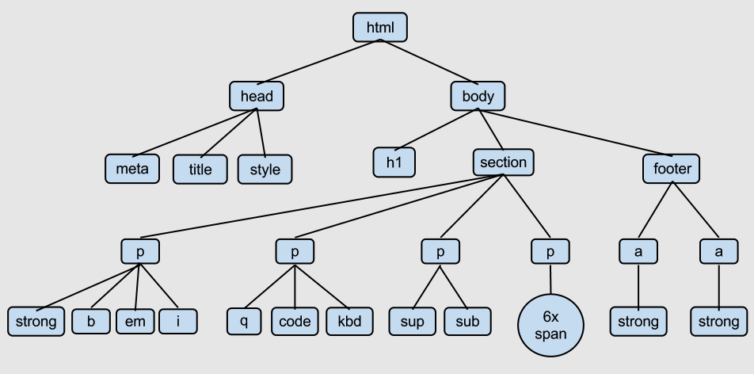
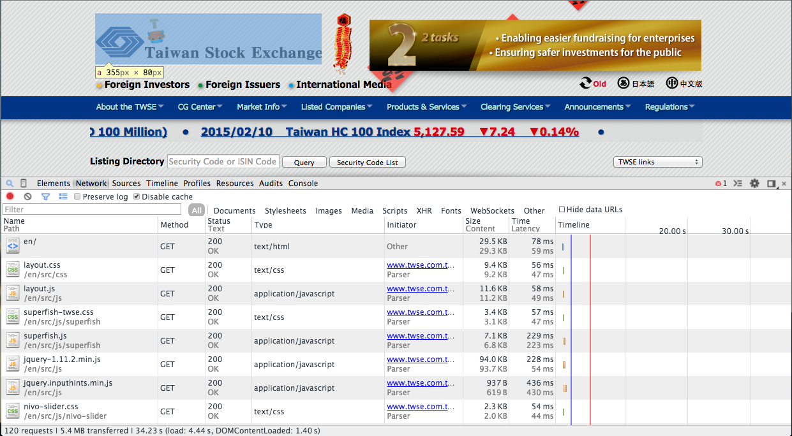

<h1>
  <font color=#005CE6>R Basic with Web Crawler</font>
</h1>
<h3>
  <font color="green">Week 1</font>
</h3>
<h3>
  <font color=#CCCCA3>Chia-Chi Chang, Yin-Chen Liao</font>
</h3>

--- &vertical

# Packages

<div align='left'>
<p>R 是個開源免費的軟體。</p>

<p>有非常多人 (駭客們) 幫它撰寫各式各樣的套件。</p>

<p>我們要去哪裡看說 R 有什麼套件呢?</p>

<p class='fragment'>主要有兩大管道:</p>
<ul>
  <li class='fragment'><a href='http://cran.r-project.org/'>CRAN</a></li>
  <li class='fragment'><a href='https://github.com/'>Github</a></li>
<ul>
<br>
<p class='fragment'>
<font size=8 color="yellow">到底我們該怎麼使用這些套件呢 =  =?</font>
</p>
</div>

***

## Packages

為了使用這些套件，我們必須先安裝它們。

- 在 R 裡安裝套件也非常簡單
- 以接下來爬蟲例子中會需要的 XML 套件為例。

```{r, cache=TRUE}
install.packages("XML")
```

***

## Packages

- 很好! 你已經成功安裝 XML 套件了。
- 為了把包含在 XML 這個套件中的相關函數"引入"供你差遣，我們需要 library() 這個函數。


```{r, cache=TRUE}
library("XML")
```

<div align='left'>
<p class='fragment'>That's it! You are ready for building simple web-crawler now.</p>
<p class='fragment'>眼見為憑，我們用一個小例子示範一下。</p>
</div>

--- &vertical

<h2>Example: TWSE </br>(臺灣證券交易所)</h2>

<br>

<center>
<font size=8>
  <p class='fragment'>This way to <a href='http://www.twse.com.tw/en/'>TWSE</a></p>
</font>
</center>

***

## TWSE 英文首頁


***


***


***

## The Code

```{r, cache=TRUE}
MOPS_URL.TWSE_ALL <-
  "http://www.twse.com.tw/en/listed/listed_company/apply_listing.php?page=1"

web_page = htmlParse(MOPS_URL.TWSE_ALL,encoding="big5")
data = readHTMLTable(web_page, which=6, stringsAsFactors=F, header = T)
names(data) <- 
  c("Application Date", "Code", "Company", "Chairman","Amount of Capital",
    "Underwriter")
data <- data[-1,]
head(data, n=3)
```

<p class="fragment">
<font color='red' size="8">Magic!</font>
</p>

---

# Your Turn!

<ul>
  <li class="fragment">平常上班不能上網亂看東西，今天可以!</li>
  <li class="fragment">找幾個有興趣的網站，並且把有興趣的資料在網站哪裡標註起來。<br>
    (print screen)</li>
  <li class="fragment">你想抓的網站有可能是靜態網頁，也可能是動態的。(What!?)</li>
  <li class="fragment">別緊張，四週課程過去後，你會了解之間的差別，也會知道如何處理它。</li>
  <li class="fragment">記得把網址都記下來噢!等等會有用。</li>
</ul>

--- &vertical

<h1>爬蟲心法
  <h2>
  <font color="yellow">模仿你的瀏覽器</font>
  </h2>  
</h1>

***

## 爬蟲心法：模仿你的瀏覽器

<ul>
 <li>基本上來說，寫爬蟲就是寫程式去模仿瀏覽器的行為。</li>
 <li>把你想要的資料從瀏覽器讀到的資料中取出來，就是一隻基本的爬蟲。</li>
 <li>那到底瀏覽器讀到了什麼資料啊??</li>
 <li>Chrome 與 Firfox 是你的好朋友。</li>
 <li class='fragment'>IE 咧?</li>
</ul>

<p class="fragment">
<font size=8 color='red'>不要問....很可怕 =  =+</font>
</p>

--- &vertical

<h1>爬蟲小幫手
  <h2><font color="yellow">GUI 小道具</font></h2>
</h1>

***

## 爬蟲小幫手: GUI 小道具

- 開發人員工具 in Chrome & Firfox
  * Mac: Cmd + Shift + I
  * Linux: Ctrl + Shift + I

***


***

<ul>
  <li>
    Postman (Chrome Plug-in)
      <ul>
        <li class='fragment'>簡單的圖形介面讓你可以對伺服器發 request。</li>
        <li class='fragment'>不懂啥是 request? 沒關係，等等會解釋。</li>
        <li class='fragment'>先偷看一下它長什麼樣子就好。</li>
      </ul>
  </li>
</ul>  

***


--- &vertical

<h1>瀏覽器之<font color="yellow">HTML</font></h1>

***

## 瀏覽器之HTML

- HTML 是 Hyper Text Markup Language 的縮寫。
- 以一個 tag 為基本單位，一般稱一個 tag 為一個 element 。
- 所謂的一個 tag ，指的是一組 <>...</>。 (有些 tag 只有一個 <>)
- 有樹狀結構。(DOM tree)
- 瀏覽器會根據下載到的 html 檔案去排版，成為人肉眼看到的網頁。

***

## Example: DOM tree



<a href="http://www.openbookproject.net/tutorials/getdown/css/lesson4.html">圖片來源</a>

***

## DOM tree: The Code

        <html>
          <head>
            <meta></meta>
            <title></title>
            <style type="text/css"></style>
          </head>
          <body>
            <h1></h1>
            <section></section>
            <footer></footer>
          </body>
        </html>

***

# Excersice:

- 用 Chrome 或 Firefox 的開發人員工具，把剛剛你找到的那些網頁的 html 檔案打開看看。
- 找看看你有興趣的資料在這些 html 檔案中的哪裡?

--- &vertical

# HTTP

***

## What is HTTP?

<div align='left'>
<ul>
<li class='fragment'>HTTP 是 "Hypertext Transfer Protocol" 的縮寫。</li>
</ul>
</div>

<div class='fragment'>
<font color='yellow'>
  有說等於沒說....=   =
</font>
</div>

<ul>
<li class="fragment">HTTP 是一種通訊協定，規定好客戶端 (client) 要如何跟伺服器端 (server) 做溝通。</li>
<li class='fragment'>簡而言之，HTTP 之於網路，就如同文法之於英文。</li>
<li class='fragment'>粗略來分，可以分為 POST、GET、PUT、DELETE ....等。</li>
</ul>

<div class="fragment" align='left'>
  其中寫爬蟲最常用的，就是 GET 與 POST 這兩種方法。
<br>

<ul>
  <li class='fragment'>更詳盡的資料可以參考<a href='http://en.wikipedia.org/wiki/Hypertext_Transfer_Protocol'> Wiki </a>上的說明。</li>
</ul>
</div>

***

## GET

***

## 忙碌的瀏覽器

<div class='fragment'>
打從我們打開一個網頁開始，瀏覽器就沒有停止工作過。
</div>
<div class='fragment'>我們先來看看瀏覽器做了些什麼事。</div>
<div class='fragment'>
<font color='blue'>
  Chrome 開發人員工具
</font>
</div>

***

## Network



<div class='fragment'>
<font color='red' size='8'>
  滿坑滿谷的 GET 啊!
</font>
</div>

***

<ul>
  <li>瀏覽器在我們打開這個網頁的時候，會幫我們下載了這個網頁所有需要的圖片、聲音與資料。</li>
  <li class='fragment'>等檔案下載好後，再排版成我們肉眼看到的網頁。</li>
  <li class='fragment'>
    <font color='yellow'>
      瀏覽器 OS: 我把資料都藏在這裡了，想要的人就去拿吧!
    </font>
  </li>
  <li class='fragment'>在我們登上偉大的航道前，再多觀察一些其他的東西吧。</li>
</ul>

***

## GET - More Than You Can Imagine

<ul>
  <li class='fragment'>URL (網址) 也可能包含了一些額外資訊，讓瀏覽器可以從 server 拿到不一樣的資料。</li>
  <li class='fragment'>這些資訊可能包含 id 、當前頁數、日期等等資訊。</li>
  <li class='fragment'>瀏覽一下 TWSE 的網站並觀察它網址的變化吧!</li>
</ul>

***

常見的 URL 形態：

<div align='left'>
  <ol>
    <li class='fragment'>
      <font color='wheat'>
      domain_name/path/to/specific/page
      </font>
    </li>
    <li class='fragment'>

      ../../..<font color='#E6E6B8'>?</font><font color='#FF9933'>field1</font><font color='#8DE28D'>=</font><font color='#9DDEFF'>value1</font><font color='#E6E6B8'>&</font><font color='#FF9933'>field2</font><font color='#8DE28D'>=</font><font color='#9DDEFF'>value2</font><font color='#E6E6B8'>&</font><font color='#FF9933'>field3</font><font color='#8DE28D'>=</font><font color='#9DDEFF'>value3</font>
    </li>
  </ol>
  <br>
  <br>
  <div class='fragment'>
  <font>
    上述兩種 URL 再 <a href="http://www.twse.com.tw/en/">TWSE</a> 的網站上都找得到。
  </font>
  </div>
  <br>
  <div class='fragment'>
  <font>
    舉例來說，我們現在瀏覽的是英文界面，如果想瀏覽中文的呢? 它們的 URL 有什麼變化？
  </font>
  </div>
</div>

<br>
<br>
<p class='fragment'>
<font color='red'>
  Try it!
</font>
</p>

***

## POST

***

## GET / POST Request by PostMan

***

## Parsor

***

## R Code - Review 

--- &vertical

# Homework


